# 1
## a

Package structure:

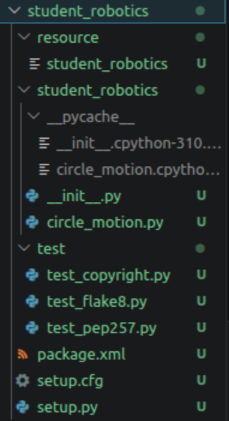

Circle motion in gazebo:

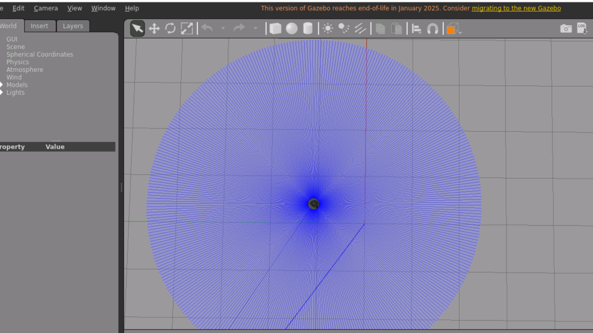 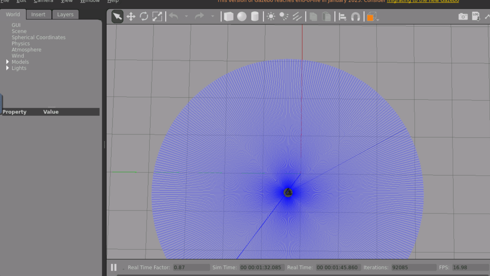

Code of circle_motion.py (modified version of file in readme of original of this repo):

```
#!/usr/bin/env python3
import rclpy
from rclpy.node import Node
from geometry_msgs.msg import Twist

class CircleMotion(Node):
    def __init__(self):
        super().__init__('circle_motion')
        
        # Create publisher: message type, topic name, queue size
        self.publisher = self.create_publisher(
            Twist,           # Message type
            '/cmd_vel',      # Topic name
            10               # Queue size
        )
        
        # Create timer: publish every 0.1 seconds
        self.timer = self.create_timer(0.1, self.publish_velocity)
        
        self.get_logger().info('Circle Motion started! Publishing to /cmd_vel')
    
    def publish_velocity(self):
        msg = Twist()
        msg.linear.x = 0.3   # Move forward at 0.2 m/s
        msg.angular.z = 0.5  # Turn left at 0.5 rad/s
        
        self.publisher.publish(msg)
        self.get_logger().info(
            f'Publishing: linear.x={msg.linear.x}, angular.z={msg.angular.z}'
        )

def main(args=None):
    rclpy.init(args=args)
    node = CircleMotion()
    rclpy.spin(node)  # Keep node running
    rclpy.shutdown()

if __name__ == '__main__':
    main()
```

Why use create_timer()?

To uphold the 10 Hz requirement stated in the assignment. 10 Hz equals every 0.1 seconds, which can be done with the timer.

## b

Python code from odom_monitor.py (once again from the repo):

```
#!/usr/bin/env python3
import rclpy
from rclpy.node import Node
from nav_msgs.msg import Odometry

class OdometryMonitor(Node):
    def __init__(self):
        super().__init__('odom_monitor')
        
        # Create subscriber: message type, topic name, callback function, queue size
        self.subscription = self.create_subscription(
            Odometry,               # Message type
            '/odom',                # Topic name
            self.odometry_callback, # Callback function
            10                      # Queue size
        )
        
        self.get_logger().info('Odometry Monitor started! Listening to /odom')
    
    def odometry_callback(self, msg):
        # Extract position
        x = msg.pose.pose.position.x
        y = msg.pose.pose.position.y
        z = msg.pose.pose.position.z
        
        # Extract linear velocity
        vx = msg.twist.twist.linear.x
        vz = msg.twist.twist.angular.z
        
        self.get_logger().info(
            f'Position: x={x:.2f}, y={y:.2f} | Velocity: vx={vx:.2f}, vz={vz:.2f}'
        )

def main(args=None):
    rclpy.init(args=args)
    node = OdometryMonitor()
    rclpy.spin(node)
    rclpy.shutdown()

if __name__ == '__main__':
    main()
```

Terminal output from circle_motion node:

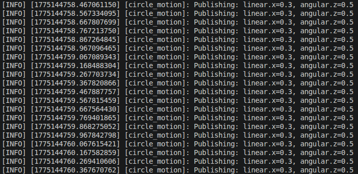

Terminal output from odom_monitor node:

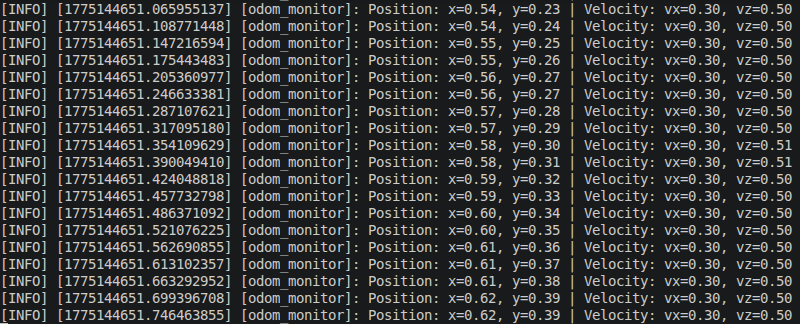

Node list:

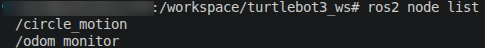

pub-sub decoupling:

pub-sub decoupling completely separates the publishers from the subscribers. Publishers just publish to topics and subscribers subscribe to them.
This means they do not have to know about each other and can just do their jobs.
It makes everything really modular and easy to replace/insert/delete stuff.

# 2
## a

topic list:

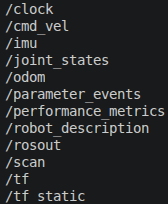

topic info cmd_vel:

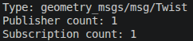

topic info odom:

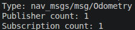

topic hz odom:

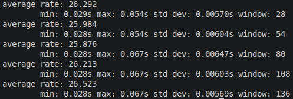

node list:

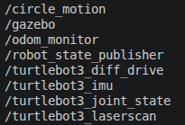

What is /odom frequency?

/odom frequency is the frequency at which things are published in the /odom topic.
This is very important in robot control as long breaks in published data can lead to outdated data which is irrelevant and therefore the robot cannot make accurate descisions.

How many publishers/subscribers does /cmd_vel have?

It has one subscriber, namely turtlebot3_diff_drive, and one publisher, namely circle_motion, found with topic info --verbose.

Difference between hz and bw:

hz is the frequency at which something is published in a topic. bw is the bandwidth, so how many bytes are published in a specific time in said topic.

## b

rqt_graph:

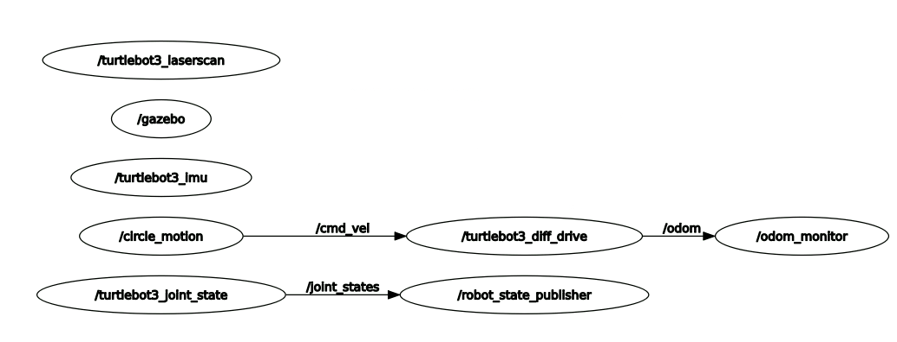

The graph shows all nodes and how they are connected via topics. A publisher is connected to the subscribers of the topic it publishes to


What happens to odom_monitor when circle_motion stops?

odom_monitor still works because it does not rely on circle_motion, it just reads from the topic. It is also not directly connected to circle_motion, it has a middle man.