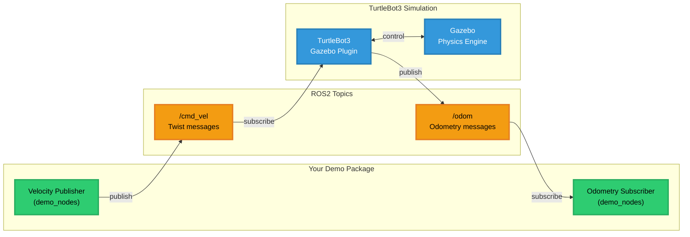
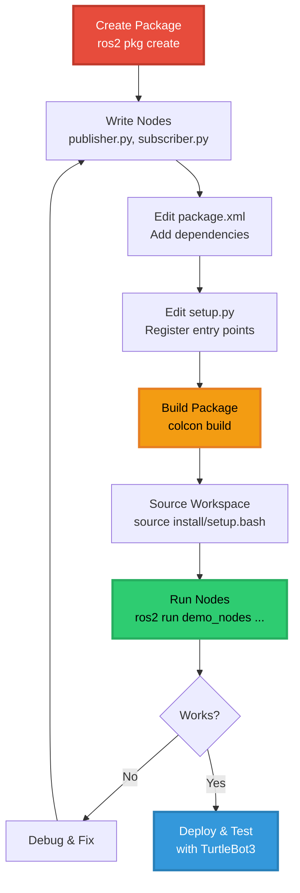
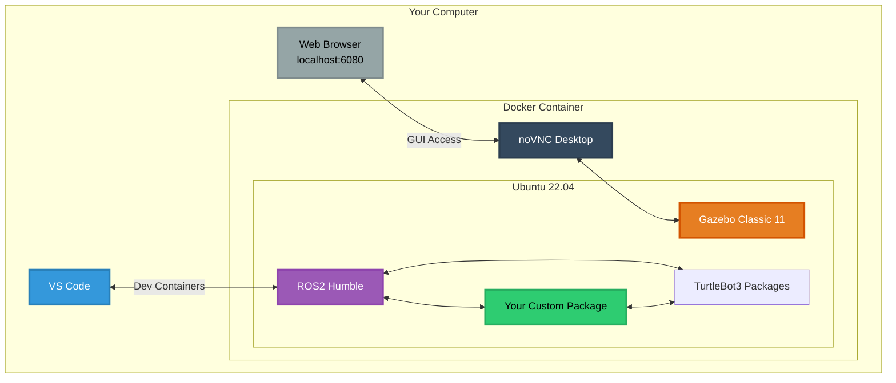
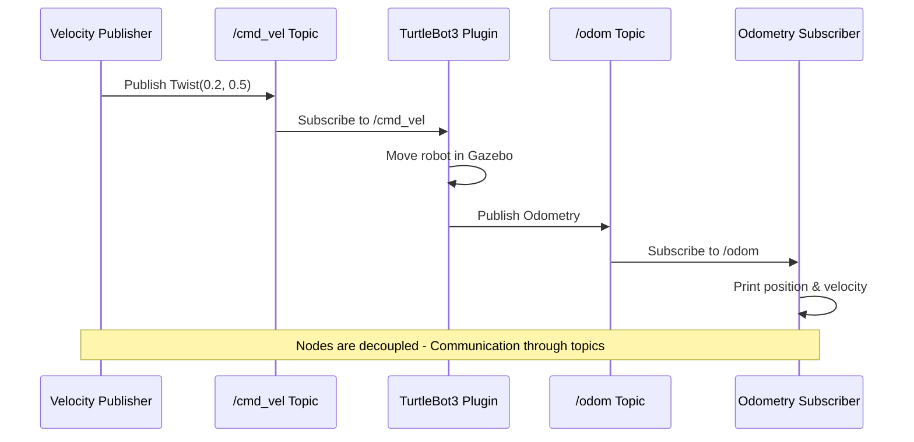

# Lecture 6: ROS 2 Concepts & Building Software Packages

> DevOps for Cyber-Physical Systems | University of Bern

Complete ROS2 Humble development environment with TurtleBot3 Burger simulation in Gazebo Classic, packaged as a VS Code Dev Container for cross-platform robotics development.

---

## Table of Contents

- [Overview](#overview)
- [How It Works](#how-it-works)
- [Prerequisites](#prerequisites)
- [Installation](#installation)
- [Quick Start](#quick-start)
- [Creating Your First ROS2 Package](#creating-your-first-ros2-package)
- [Usage](#usage)
- [Project Structure](#project-structure)
- [Configuration](#configuration)
- [Troubleshooting](#troubleshooting)
- [Learning Resources](#learning-resources)

---

## Overview

This project provides a complete, ready-to-use ROS2 Humble development environment running inside a Docker container. No need to install ROS2, Gazebo, or manage dependencies on your host system—everything runs in an isolated, reproducible environment that works identically on Windows, macOS, and Linux.

### Features

- **ROS2 Humble** (Ubuntu 22.04 Jammy)
- **Gazebo Classic 11** simulator with software rendering support
- **TurtleBot3 Burger** robot packages
- **Navigation2** and **SLAM** (Cartographer)
- **noVNC Desktop** for browser-based GUI access
- **Pre-configured development environment** with VS Code extensions
- **Platform-agnostic**: Works on Windows, macOS, and Linux

---

## How It Works

### ROS2 Communication Architecture



### Package Development Workflow



### Container Architecture



### Technology Stack

**Docker Containers**: Lightweight, portable environments that package your entire development setup (OS, ROS2, Gazebo, dependencies) into a reproducible unit that runs identically everywhere.

**VS Code Dev Containers**: Develop inside a Docker container seamlessly—your code editor, terminal, and debugger work as if running locally.

**ROS2 (Robot Operating System)**: A flexible framework for robot software providing libraries and tools for robot application development.

**Gazebo**: A 3D robot simulator with accurate physics, sensors, and actuator simulation.

**noVNC**: Browser-based VNC client for accessing a full Linux desktop through your web browser without installing additional software.

### Why Use Containers?

1. **Consistency**: Everyone gets the exact same environment
2. **Isolation**: No conflicts with other software on your system
3. **Portability**: Works on Windows, Mac, and Linux
4. **Clean**: Delete the container—your system remains unchanged
5. **Version Control**: The entire environment is defined in code

---

## Prerequisites

### Required Software

- **Docker**:
  - Windows/Mac: [Docker Desktop](https://www.docker.com/products/docker-desktop/)
  - Linux: [Docker Engine](https://docs.docker.com/engine/install/)
- **VS Code**: [Download here](https://code.visualstudio.com/)
- **Dev Containers Extension**: Install from VS Code Extensions (Ctrl+Shift+X, search "Dev Containers")


### System Requirements

- **Minimum**: 4 CPU cores, 8GB RAM, 20GB free disk space
- **Recommended**: 6+ CPU cores, 16GB RAM, 50GB free disk space
- **Operating Systems**:
  - Windows 10/11 with Docker Desktop
  - macOS 10.15 or later
  - Any modern Linux distribution with Docker installed

---

## Installation

### Step 1: Install Docker

#### Windows/macOS
1. Download and install [Docker Desktop](https://www.docker.com/products/docker-desktop/)
2. Use default settings during installation
3. Restart your computer after installation
4. Start Docker Desktop from your applications menu
5. **Allocate Resources** (Important!):
   - Open Docker Desktop → Settings → Resources
   - Set CPUs: 6-8 cores
   - Set Memory: 12-16 GB
   - Apply & Restart
6. Verify installation:
   ```bash
   docker --version
   docker run hello-world
   ```

#### Linux (Ubuntu/Debian example)
```bash
# Install Docker Engine
curl -fsSL https://get.docker.com -o get-docker.sh
sudo sh get-docker.sh

# Add user to docker group
sudo usermod -aG docker $USER

# Log out and back in, then verify
docker --version
docker run hello-world
```

### Step 2: Install VS Code

1. Download VS Code from [code.visualstudio.com](https://code.visualstudio.com/)
2. Install with default settings
3. Launch VS Code

### Step 3: Install Dev Containers Extension

1. In VS Code, press `Ctrl+Shift+X` (or `Cmd+Shift+X` on Mac)
2. Search for "Dev Containers"
3. Click "Install" on the extension by Microsoft

### Step 4: Clone This Repository

```bash
git clone https://github.com/prakash-aryan/lecture6-ros2demo.git
cd lecture6-ros2demo
```

---

## Quick Start

### First Launch (10-15 minutes initial build)

1. **Open in VS Code:**
   ```bash
   code .
   ```

2. **Open in Container:**
   - VS Code will detect `.devcontainer` and show a popup
   - Click "Reopen in Container"
   - OR press `F1` → type "Dev Containers: Reopen in Container"


3. **Wait for Build:**
   - First time: 10-15 minutes (downloads and builds everything)
   - Subsequent launches: 10-30 seconds

4. **Access Gazebo GUI:**
   - Open browser: http://localhost:6080
   - Password: `ros`
   - Wait for desktop to load (~10 seconds)

5. **Launch TurtleBot3:**
   ```bash
   # In VS Code terminal
   tb3_empty
   ```
   - Wait 30-60 seconds for Gazebo to fully start
   - Robot will appear in VNC browser window

### Quick Launch Aliases

Pre-configured shortcuts for common tasks:

```bash
tb3_empty      # Launch empty world
tb3_world      # Launch TurtleBot3 world  
tb3_house      # Launch house world
tb3_teleop     # Keyboard control

cb             # Build workspace (colcon build)
sb             # Source workspace
```

---

## Creating Your First ROS2 Package

This section walks you through creating a complete ROS2 package with publisher and subscriber nodes that control TurtleBot3.

### Step 1: Create Package Structure

```bash
cd /workspace/turtlebot3_ws/src

# Create a new Python package
ros2 pkg create --build-type ament_python \
  --node-name my_first_node \
  demo_nodes

# Verify structure
cd demo_nodes
tree
```

**You'll see:**
```
demo_nodes/
├── demo_nodes/
│   └── __init__.py
├── package.xml
├── setup.py
├── setup.cfg
├── resource/
│   └── demo_nodes
└── test/
```

### Step 2: Examine Package Files

**View package.xml** (defines metadata and dependencies):
```bash
code package.xml
```

Key sections:
- `<name>` - Package identifier (must match folder name)
- `<version>` - Package version
- `<maintainer>` - Your name and email
- `<depend>` - Runtime dependencies

**View setup.py** (defines how Python package installs):
```bash
code setup.py
```

Key section - `entry_points`:
```python
'console_scripts': [
    'my_first_node = demo_nodes.my_first_node:main',
],
```
This makes `ros2 run demo_nodes my_first_node` work!

### Step 3: Create a Publisher Node

Create a new file for your velocity publisher:

```bash
cd /workspace/turtlebot3_ws/src/demo_nodes/demo_nodes
code velocity_publisher.py
```

**Paste this code:**

```python
#!/usr/bin/env python3
import rclpy
from rclpy.node import Node
from geometry_msgs.msg import Twist

class VelocityPublisher(Node):
    def __init__(self):
        super().__init__('velocity_publisher')
        
        # Create publisher: message type, topic name, queue size
        self.publisher = self.create_publisher(
            Twist,           # Message type
            '/cmd_vel',      # Topic name
            10               # Queue size
        )
        
        # Create timer: publish every 0.5 seconds
        self.timer = self.create_timer(0.5, self.publish_velocity)
        
        self.get_logger().info('Velocity Publisher started! Publishing to /cmd_vel')
    
    def publish_velocity(self):
        msg = Twist()
        msg.linear.x = 0.2   # Move forward at 0.2 m/s
        msg.angular.z = 0.5  # Turn left at 0.5 rad/s
        
        self.publisher.publish(msg)
        self.get_logger().info(
            f'Publishing: linear.x={msg.linear.x}, angular.z={msg.angular.z}'
        )

def main(args=None):
    rclpy.init(args=args)
    node = VelocityPublisher()
    rclpy.spin(node)  # Keep node running
    rclpy.shutdown()

if __name__ == '__main__':
    main()
```

**Key concepts:**
- `Node` base class provides ROS2 functionality
- `create_publisher()` sets up communication channel
- `create_timer()` calls callback at regular intervals
- `publish()` sends messages to topic
- `get_logger()` prints to console for debugging

### Step 4: Create a Subscriber Node

Create a new file for odometry subscriber:

```bash
code odometry_subscriber.py
```

**Paste this code:**

```python
#!/usr/bin/env python3
import rclpy
from rclpy.node import Node
from nav_msgs.msg import Odometry

class OdometrySubscriber(Node):
    def __init__(self):
        super().__init__('odometry_subscriber')
        
        # Create subscriber: message type, topic name, callback function, queue size
        self.subscription = self.create_subscription(
            Odometry,               # Message type
            '/odom',                # Topic name
            self.odometry_callback, # Callback function
            10                      # Queue size
        )
        
        self.get_logger().info('Odometry Subscriber started! Listening to /odom')
    
    def odometry_callback(self, msg):
        # Extract position
        x = msg.pose.pose.position.x
        y = msg.pose.pose.position.y
        z = msg.pose.pose.position.z
        
        # Extract linear velocity
        vx = msg.twist.twist.linear.x
        vz = msg.twist.twist.angular.z
        
        self.get_logger().info(
            f'Position: x={x:.2f}, y={y:.2f} | Velocity: vx={vx:.2f}, vz={vz:.2f}'
        )

def main(args=None):
    rclpy.init(args=args)
    node = OdometrySubscriber()
    rclpy.spin(node)
    rclpy.shutdown()

if __name__ == '__main__':
    main()
```

**Key concepts:**
- `create_subscription()` listens to a topic
- Callback function executes when new message arrives
- Access message fields with dot notation: `msg.pose.pose.position.x`

### Step 5: Register Nodes in setup.py

Open setup.py in VS Code:

```bash
cd /workspace/turtlebot3_ws/src/demo_nodes
code setup.py
```

**Find the `entry_points` section and update it:**

```python
entry_points={
    'console_scripts': [
        'velocity_publisher = demo_nodes.velocity_publisher:main',
        'odometry_subscriber = demo_nodes.odometry_subscriber:main',
    ],
},
```

**This registers both nodes so you can run them with:**
- `ros2 run demo_nodes velocity_publisher`
- `ros2 run demo_nodes odometry_subscriber`

### Step 6: Add Dependencies to package.xml

Open package.xml:

```bash
code package.xml
```

**Add these dependencies before `</package>`:**

```xml
<depend>rclpy</depend>
<depend>geometry_msgs</depend>
<depend>nav_msgs</depend>
```

**Why?**
- `rclpy` - Python ROS2 client library
- `geometry_msgs` - Contains Twist message type
- `nav_msgs` - Contains Odometry message type

### Step 7: Build Your Package

```bash
cd /workspace/turtlebot3_ws

# Build only your new package (faster)
colcon build --packages-select demo_nodes

# Source the workspace (IMPORTANT!)
source install/setup.bash
```

**Build output should show:**
```
Starting >>> demo_nodes
Finished <<< demo_nodes [2.5s]

Summary: 1 package finished
```

### Step 8: Run with TurtleBot3! 🎉

**Terminal 1 - Launch TurtleBot3:**
```bash
tb3_empty
```
Wait for Gazebo to fully load (30-60 seconds).

**Terminal 2 - Run Publisher:**
```bash
# Source workspace first
source /workspace/turtlebot3_ws/install/setup.bash

# Run the velocity publisher
ros2 run demo_nodes velocity_publisher
```

**You'll see:**
- Log messages showing velocity being published
- TurtleBot3 moving in circles in Gazebo!

**Terminal 3 - Run Subscriber:**
```bash
# Source workspace
source /workspace/turtlebot3_ws/install/setup.bash

# Run the odometry subscriber
ros2 run demo_nodes odometry_subscriber
```

**You'll see:**
- Robot's position updating
- Velocity values matching what publisher sends

**Terminal 4 - Inspect Topics:**
```bash
# List all topics
ros2 topic list

# Check who's publishing/subscribing to /cmd_vel
ros2 topic info /cmd_vel

# Echo messages on /cmd_vel
ros2 topic echo /cmd_vel

# Check message frequency
ros2 topic hz /odom
```

### Understanding What Just Happened



**This is ROS2's pub-sub pattern:**
- Nodes are decoupled (don't know about each other)
- Communication through topics
- Multiple subscribers can listen to same topic
- Publishers don't wait for subscribers

---

## Usage

### Common ROS2 Commands

```bash
# List all topics
ros2 topic list

# Echo messages from a topic
ros2 topic echo /cmd_vel

# Get topic info
ros2 topic info /odom

# Check message frequency
ros2 topic hz /scan

# List all nodes
ros2 node list

# Get node info
ros2 node info /turtlebot3_diff_drive

# List all services
ros2 service list

# Call a service
ros2 service call /spawn_entity gazebo_msgs/srv/SpawnEntity "{}"

# List parameters
ros2 param list

# Get parameter value
ros2 param get /turtlebot3_diff_drive wheel_separation
```

### Build System (colcon)

```bash
# Build all packages
colcon build

# Build with symlink install (faster for Python development)
colcon build --symlink-install

# Build specific package
colcon build --packages-select demo_nodes

# Build up to a package (including dependencies)
colcon build --packages-up-to demo_nodes

# Build with verbose output
colcon build --event-handlers console_direct+

# Clean build
rm -rf build install log
colcon build --symlink-install
```

### Keyboard Teleop

Control TurtleBot3 with your keyboard:

```bash
tb3_teleop
```

**Controls:**
```
Moving around:
   w
 a s d
   x

w/x : increase/decrease linear velocity
a/d : increase/decrease angular velocity
space/s : force stop
CTRL-C to quit
```

---

## Project Structure

```
lecture6-ros2-demo/
├── .devcontainer/
│   ├── Dockerfile               # Container image definition
│   ├── devcontainer.json        # VS Code configuration
│   ├── post-create.sh           # Setup script (runs once)
│   ├── post-start.sh            # Startup script (runs every time)
│   └── verify-setup.sh          # Verification script
├── src/                         # Your ROS2 packages go here
│   └── demo_nodes/              # Example package created above
├── .gitignore                   # Git ignore rules
├── .gitattributes               # Git attributes
├── LICENSE                      # License file
└── README.md                    # This file
```

### ROS2 Workspace Structure

```
/workspace/turtlebot3_ws/
├── src/              # Source code (you work here)
│   ├── turtlebot3/           # TurtleBot3 packages
│   ├── turtlebot3_msgs/      # TurtleBot3 messages
│   ├── turtlebot3_simulations/  # Gazebo simulation
│   └── demo_nodes/           # Your custom packages
├── build/            # Build artifacts (auto-generated)
├── install/          # Installed binaries (auto-generated)
└── log/              # Build logs (auto-generated)
```

---

## Configuration

### Environment Variables

Automatically set in the container:

```bash
ROS_DISTRO=humble                       # ROS2 version
ROS_DOMAIN_ID=30                        # Network isolation
TURTLEBOT3_MODEL=burger                 # Robot model
RMW_IMPLEMENTATION=rmw_cyclonedds_cpp   # DDS implementation
DISPLAY=:1                              # VNC display
QT_QPA_PLATFORM=xcb                     # Qt platform
GAZEBO_MODEL_PATH=/usr/share/gazebo-11/models  # Local models only
GAZEBO_MODEL_DATABASE_URI=""            # Disable internet downloads
```

### Changing Robot Model

Edit `.devcontainer/devcontainer.json`:
```json
"remoteEnv": {
  "TURTLEBOT3_MODEL": "waffle"  // Options: burger, waffle, waffle_pi
}
```
Rebuild container: F1 → "Dev Containers: Rebuild Container"

---

## Troubleshooting

### Gazebo Takes Too Long to Start

**Solution**: The environment variables are already configured to prevent internet model downloads. If it still takes long:

1. **Increase Docker Resources:**
   - Docker Desktop → Settings → Resources
   - CPUs: 6-8 cores
   - Memory: 12-16 GB

2. **Check if variables are set:**
   ```bash
   echo $GAZEBO_MODEL_PATH
   echo $GAZEBO_MODEL_DATABASE_URI
   ```

### Robot Doesn't Spawn

**Symptoms:**
- `spawn_entity` timeout error after 30 seconds
- Gazebo launches but robot doesn't appear

**Solution:**
Gazebo server takes time to initialize. Be patient and wait the full 60 seconds.

### Build Fails

**Solution:**
```bash
# Clean and rebuild
cd /workspace/turtlebot3_ws
rm -rf build install log
colcon build --symlink-install

# Check for missing dependencies
rosdep install --from-paths src --ignore-src -y
```

### Can't Access VNC

**Solution:**
1. Check Port Forwarding in VS Code:
   - View → Ports
   - Port 6080 should be listed

2. Try direct link: http://localhost:6080

3. Restart desktop-lite:
   ```bash
   sudo supervisorctl restart desktop-lite
   ```

### Package Not Found After Building

**Symptoms:**
- `Package 'demo_nodes' not found` after building

**Solution:**
```bash
# Always source after building
source /workspace/turtlebot3_ws/install/setup.bash

# Or use the alias
sb
```

---

## Learning Resources

### Official Documentation
- [ROS2 Humble Documentation](https://docs.ros.org/en/humble/)
- [TurtleBot3 Manual](https://emanual.robotis.com/docs/en/platform/turtlebot3/overview/)
- [Gazebo Classic Documentation](http://classic.gazebosim.org/)
- [colcon Documentation](https://colcon.readthedocs.io/)

### Tutorials
- [ROS2 Tutorials](https://docs.ros.org/en/humble/Tutorials.html)
- [Creating a ROS2 Package](https://docs.ros.org/en/humble/Tutorials/Beginner-Client-Libraries/Creating-Your-First-ROS2-Package.html)
- [Writing Publisher/Subscriber (Python)](https://docs.ros.org/en/humble/Tutorials/Beginner-Client-Libraries/Writing-A-Simple-Py-Publisher-And-Subscriber.html)

---

## License

This project is licensed under the MIT License - see the [LICENSE](LICENSE) file for details.

---

## Acknowledgments

- Based on ROBOTIS TurtleBot3 packages
- Uses osrf/ros Docker images
- Built for DevOps for Cyber-Physical Systems course at University of Bern
